<p align="center">
  <a href="mailto:parthkishan20@gmail.com"></a>
  <a href="https://parthkumar.me"></a>
  <a href="https://linkedin.com/in/parthkishan20"></a>
</p>


```
$ open --project
```
`01` [Refund Agent demo](https://parthkumar.me/claude-exam/demo) · `02` [AI Resume Tailoring Platform](https://github.com/parthkishan20/resume-tailoring-platform) · `03` [Ledger (live)](https://hisab.parthkumar.me) · `04` [Financial QA Bot](https://github.com/parthkishan20/Final-project-FE-520-QA-Bot)







<details>
<summary><code>$ ls ~/projects/more</code></summary>
<br>

| | Project | What it is |
|---|---|---|
| 05 | **[SortBoard](https://parthkishan20.github.io/SortBoard/)** · live | 6 sorting algorithms animated with generator-based execution · React 19, Vite |
| 06 | **[MRTD Validation System](https://github.com/Aayush-Gandhi/SSW_Final-Project_-Group-H)** | Passport MRZ engine · 86% coverage · 406-mutant mutation testing · ~156K decodes/sec |
| 07 | **[Mini Search Engine](https://github.com/parthkishan20/Mini-Search-Engine)** | Inverted index, custom crawler, ranking, Flask UI |
| 08 | **[MouseMacro](https://github.com/parthkishan20/MouseMacro)** | macOS menu bar app remapping mouse buttons via Quartz Event Taps · Swift |
| 09 | **ML pipelines** | Credit-score classification on 100K records (SMOTE, six-model comparison) · heart-disease prediction (KNN / RF / ANN) |

</details>

<details>
<summary><code>$ cat certifications.txt</code></summary>
<br>

- **Anthropic:** Building with the Claude API · Intro to Model Context Protocol · Claude Code in Action · Claude 101 · Claude Code 101 · AI Fluency
- **LinkedIn Learning:** Advanced Prompt Engineering
- **Bloomberg:** Bloomberg Market Concepts

</details>

```
$ ./contact --hiring
```
**[parthkishan20@gmail.com](mailto:parthkishan20@gmail.com)** · **[parthkumar.me](https://parthkumar.me)** · **[linkedin.com/in/parthkishan20](https://linkedin.com/in/parthkishan20)**

<!-- Terminal windows are generated by scripts/terminal/gen_term.py. Re-run it to update numbers. -->
